# Modelo de domínio — Plataforma para Psicólogos

**Responsável:** Integrante 3 — Modelagem Orientada a Objetos e domínio.  
**Status:** versão inicial para revisão cruzada; não constitui aprovação das pendências do grupo.

## 1. Objetivo e limites

Representar os conceitos do domínio, suas associações e as restrições sustentadas pelos documentos existentes. Este é um modelo conceitual: não define métodos, serviços, interfaces, banco de dados, arquitetura ou diagramas comportamentais.

A base de requisitos ainda está para revisão, conforme o [README de requisitos](../../02-requisitos/README.md). Decisões formais registradas prevalecem sobre possibilidades de anotações preparatórias: paciente possui acesso autenticado limitado (DEC-006), Atendente está excluído (DEC-007), serviço externo e inovação continuam pendentes (DEC-009 e DEC-010).

Não são incorporados Pagamento, ProntuarioCompleto, ListaEspera, integração de e-mail ou outros conceitos dessas funcionalidades. Não há dados de pessoas ou pacientes neste modelo; todos os elementos são conceitos abstratos, sem instâncias reais.

## 2. Fontes e convenções

- [Requisitos funcionais](../../02-requisitos/requisitos-funcionais.md).
- [Regras de negócio](../../02-requisitos/regras-negocio.md).
- [Requisitos não funcionais](../../02-requisitos/requisitos-nao-funcionais.md).
- [Critérios de aceite](../../02-requisitos/criterios-aceite.md).
- [Glossário](../../02-requisitos/glossario.md).
- [Escopo](../../02-requisitos/escopo.md) e [visão](../../02-requisitos/visao.md).
- [Decisões](../../01-planejamento/decisoes.md) e [atores](../../02-requisitos/stakeholders-atores.md).

O escopo exige UML 2.x quando aplicável (RES-004), e o [README de UML](../README.md) prevê fontes editáveis sem determinar ferramenta. Mermaid classDiagram é utilizado como representação textual editável de classes conceituais e associações. Não substitui uma validação formal de conformidade UML.

Os identificadores seguem os conceitos em português, no singular, sem acentos: Usuario corresponde a Usuário; Paciente corresponde a Cliente/Paciente. Perfil significa exclusivamente perfil de acesso. Os nomes A01–A16 identificam associações apenas neste documento; não são novos requisitos nem decisões oficiais.

**Multiplicidades:** somente o valor numérico sustentado pelas fontes é fixado. A marca PENDENTE, em cada extremo ainda indefinido, é uma anotação editorial, não uma multiplicidade UML válida. Ela não equivale a 1, 0..1 ou 0..*. Deve ser substituída por multiplicidade UML após validação do grupo. Assim, o diagrama é deliberadamente parcial e não deve ser apresentado como modelo UML finalizado.

Uma multiplicidade junto a um conceito indica quantas instâncias daquele conceito se relacionam a uma instância do outro extremo. Por exemplo, Psicologo "1" -- "PENDENTE" Vinculo significa um psicólogo por vínculo, com quantidade de vínculos por psicólogo pendente.

Usam-se associações simples, sem inferir navegabilidade, herança, agregação, composição ou exclusão em cascata. Não há suporte documental suficiente para assumir esses ciclos de vida.

## 3. Conceitos e rastreabilidade

As informações conceituais abaixo não são um dicionário de atributos de implementação. Campos específicos, tipos e obrigatoriedade não descritos nas fontes ficam para refinamento posterior.

| Conceito | Significado e informações sustentadas | Fundamentação |
|---|---|---|
| Usuario | Conta de acesso com identificação própria, credencial protegida e situação de acesso. Não confunde dados de conta com cadastro profissional ou de paciente. | RF-001–006, RF-010; RN-001–002; RNF-001–003; PRE-001 |
| Perfil | Agrupamento de responsabilidades e permissões atribuível a usuários. Administrador é inicialmente um papel/perfil autorizado. | RF-003, RF-007–009; RNF-002; glossário e atores |
| Permissao | Autorização para executar operação, associada a perfil. Não autoriza automaticamente acesso a quaisquer dados: propriedade e vínculo também restringem consultas. | RF-008; RN-003–004, RN-008; RNF-002 |
| Psicologo | Cadastro profissional relacionado à conta de acesso, com dados profissionais e áreas de atuação. “Perfil profissional” designa essas informações, não Perfil de acesso. Campos editáveis ainda precisam ser detalhados. | RF-011, RF-014–017; RN-003; RNF-006 |
| AreaAtuacao | Campo de especialidade ou linha de atuação associável ao profissional. Não pressupõe funcionalidade de manutenção de catálogo. | RF-016; PRE-002; glossário |
| Paciente | Cadastro administrativo de Cliente/Paciente, com situação cadastral e acesso próprio limitado. Estados cadastrais e campos permitidos ainda não estão completos. | RF-012, RF-018–022, RF-028; RN-004; RNF-005; DEC-006 |
| Vinculo | Relação formal e autorizada entre um Psicologo e um Paciente, considerada na autorização profissional. Não pressupõe regras de encerramento já aprovadas. | RF-017, RF-021, RF-024–025, RF-030–031; RN-003, RN-007 |
| Agenda | Organização da disponibilidade e dos compromissos do psicólogo titular. Não presume uma quantidade total de agendas por profissional. | RF-023–024, RF-029; RN-005, RN-011 |
| Disponibilidade | Período oferecido pelo psicólogo em sua agenda, considerado com conflitos e agendamentos na consulta de horários. Recorrência e fuso não estão definidos. | RF-023–025; RN-005, RN-010–011; glossário |
| Agendamento | Solicitação/reserva de horário associada a profissional, paciente e situação. Estado inicial e efeito da solicitação na disponibilidade permanecem pendentes. | RF-025–029; RN-005–006, RN-009–010, RN-012–013 |
| Atendimento | Registro conceitual da sessão realizada, relacionado ao profissional e paciente válidos, com vínculo autorizado e sessão válida da agenda. Não é prontuário clínico completo. | RF-030–031; RN-006–007; escopo 3.6; DEC-008 |
| RegistroAuditoria | Registro de operação com usuário responsável, data, hora e operação identificáveis, em trilha cronológica e logicamente imutável. | RF-013, RF-032; RN-008–009, RN-014; RNF-004 |

RNF-007 fundamenta a integridade das associações; RNF-008 orienta a separação de responsabilidades; RNF-011 e RNF-012 orientam rastreabilidade e consistência terminológica.

Administrador não aparece como classe independente porque os documentos o definem por funções e permissões, sem cadastro de domínio próprio. Não se presume que Psicologo ou Paciente sejam subclasses de Usuario. A associação distingue conta e cadastro sem decidir se uma pessoa pode acumular papéis.

RF-002 trata sessão autenticada, mas não exige que ela seja entidade deste modelo de domínio. RF-009 trata uma interface de acesso administrativo, não uma entidade. Consultas e manutenção são responsabilidades funcionais, não novos conceitos a serem transformados automaticamente em classes.

## 4. Diagrama editável

Fonte: [diagrama-dominio.mmd](diagrama-dominio.mmd). O bloco abaixo reproduz a fonte para leitura em visualizadores Markdown com suporte a Mermaid. Ao revisar o modelo, manter as duas representações sincronizadas.

```mermaid
classDiagram
    direction TB
    %% Modelo conceitual parcial. PENDENTE e uma anotacao editorial,
    %% nao uma multiplicidade UML. Consultar modelo-dominio.md.
    class Usuario
    class Perfil
    class Permissao
    class Psicologo
    class AreaAtuacao
    class Paciente
    class Vinculo
    class Agenda
    class Disponibilidade
    class Agendamento
    class Atendimento
    class RegistroAuditoria

    Usuario "PENDENTE" -- "PENDENTE" Perfil : A01 possui perfil de acesso
    Perfil "PENDENTE" -- "PENDENTE" Permissao : A02 agrupa
    Usuario "PENDENTE" -- "PENDENTE" Psicologo : A03 conta do cadastro profissional
    Usuario "PENDENTE" -- "PENDENTE" Paciente : A04 conta do cadastro de paciente
    Psicologo "PENDENTE" -- "PENDENTE" AreaAtuacao : A05 atua em
    Psicologo "1" -- "PENDENTE" Vinculo : A06 participa
    Paciente "1" -- "PENDENTE" Vinculo : A07 participa
    Psicologo "1" -- "PENDENTE" Agenda : A08 titular
    Agenda "1" -- "PENDENTE" Disponibilidade : A09 organiza
    Agenda "PENDENTE" -- "PENDENTE" Agendamento : A10 apresenta compromissos
    Psicologo "1" -- "PENDENTE" Agendamento : A11 profissional agendado
    Paciente "1" -- "PENDENTE" Agendamento : A12 paciente agendado
    Psicologo "1" -- "PENDENTE" Atendimento : A13 profissional responsavel
    Paciente "1" -- "PENDENTE" Atendimento : A14 paciente atendido
    Agendamento "PENDENTE" -- "PENDENTE" Atendimento : A15 corresponde a sessao
    Usuario "1" -- "PENDENTE" RegistroAuditoria : A16 responsavel pela operacao

    note "PENDENTE indica multiplicidade ainda nao definida; nao significa 1 nem 0..*. Modelo parcial para revisao."
    note for Usuario "Conta de acesso distinta dos cadastros. Credencial protegida; nunca senha em texto puro."
    note for Perfil "Perfil de acesso. Administrador e um papel, nao uma classe independente."
    note for Psicologo "Cadastro profissional. Perfil profissional nao e Perfil de acesso."
    note for AreaAtuacao "RF-016 admite uma ou mais areas; minimo durante o cadastro e compartilhamento ainda pendentes."
    note for Vinculo "Cada vinculo identifica um psicologo e um paciente. Quantidades e encerramento pendentes."
    note for Agendamento "Exige vinculo autorizado e horario disponivel. RN-005 impede conflitos ativos."
    note for Atendimento "Exige vinculo autorizado entre os mesmos participantes. Cancelamento impede realizacao (RN-006)."
    note for RegistroAuditoria "Usuario responsavel, data, hora e operacao. Cronologico e logicamente imutavel."
```

## 5. Associações e multiplicidades

As colunas expressam quantidades em linguagem natural, evitando ambiguidade sobre os extremos. Não se presume que uma quantidade pendente seja ilimitada.

| ID | Associação | Quantidade sustentada ou pendente | Fontes e justificativa |
|---|---|---|---|
| A01 | Usuario — Perfil | Perfis por usuário: PENDENTE. Usuários por perfil: PENDENTE. | RF-003, RF-007–008 exigem associação autorizada, sem fechar perfil único/múltiplo e multiplicidades de todo o ciclo cadastral. |
| A02 | Perfil — Permissao | Permissões por perfil: PENDENTE. Perfis por permissão: PENDENTE. | RF-007–008 e glossário definem agrupamento, mas não mínimos, máximos ou compartilhamento. |
| A03 | Usuario — Psicologo | Contas por cadastro profissional: PENDENTE. Cadastros profissionais por conta: PENDENTE. | RF-014 distingue e relaciona conta e cadastro; não formaliza cardinalidade. |
| A04 | Usuario — Paciente | Contas por cadastro de paciente: PENDENTE. Cadastros de paciente por conta: PENDENTE. | RF-018 depende de RF-003; DEC-006 confirma acesso. Momento de associação e cardinalidade exata não estão formalizados. |
| A05 | Psicologo — AreaAtuacao | Áreas por profissional: multiplicidade global PENDENTE; uma ou mais áreas são admitidas. Profissionais por área: PENDENTE. | RF-016, PRE-002 e visão sustentam múltiplas áreas, mas não esclarecem cadastro ainda sem área, limite máximo e compartilhamento. Não se impõe 1..* a todo o ciclo de vida. |
| A06 | Psicologo — Vinculo | Psicólogos por vínculo: 1. Vínculos por psicólogo: PENDENTE. | RF-021 e glossário definem o vínculo entre um psicólogo e um paciente, sem limites de vínculos por participante. |
| A07 | Paciente — Vinculo | Pacientes por vínculo: 1. Vínculos por paciente: PENDENTE. | RF-021; não está aprovado limite de profissionais simultâneos, nem repetição histórica de vínculos para o mesmo par. |
| A08 | Psicologo — Agenda | Titular por agenda profissional: 1. Agendas por psicólogo: PENDENTE. | RF-023, RF-029 e RN-011 identificam agenda própria. Não se infere relação global 1:1. |
| A09 | Agenda — Disponibilidade | Agenda por período de disponibilidade: 1. Períodos por agenda: PENDENTE. | RF-023 e RN-011 vinculam o período à própria agenda. Quantidades e ciclo de cadastro não são fechados. |
| A10 | Agenda — Agendamento | Agendamentos por agenda: PENDENTE. Agendas por agendamento: PENDENTE. | RF-029 estabelece compromissos associados à agenda; não define estrutura de agrupamento nem cardinalidades. |
| A11 | Psicologo — Agendamento | Psicólogos por agendamento: 1. Agendamentos por psicólogo: PENDENTE. | RF-025–026 associam solicitação a um psicólogo, paciente e horário. |
| A12 | Paciente — Agendamento | Pacientes por agendamento: 1. Agendamentos por paciente: PENDENTE. | RF-025 e RF-028 identificam o paciente do agendamento. |
| A13 | Psicologo — Atendimento | Psicólogos responsáveis por atendimento: 1. Atendimentos por psicólogo: PENDENTE. | RF-030, RN-007 e escopo 3.6 exigem o profissional responsável. |
| A14 | Paciente — Atendimento | Pacientes por atendimento: 1. Atendimentos por paciente: PENDENTE. | RF-030, RN-007 e escopo 3.6 exigem o paciente atendido. |
| A15 | Agendamento — Atendimento | Atendimentos por agendamento: PENDENTE. Agendamentos por atendimento: PENDENTE. | RF-030 exige sessão válida da agenda e RN-006 relaciona cancelamento à impossibilidade de atendimento realizado. Isso sustenta a correspondência, mas não fixa 1:1 ou 1:0..1. |
| A16 | Usuario — RegistroAuditoria | Usuários responsáveis por registro: 1. Registros por usuário: PENDENTE. | RF-032 e RNF-004 exigem identificação do usuário responsável. Este é o autor da operação, não necessariamente o usuário afetado nem quem consulta o registro. |

O modelo não cria ligação persistente obrigatória entre Disponibilidade e Agendamento: RN-010 exige verificar o horário disponível no momento da solicitação, mas não define a forma de armazenar essa relação.

Vinculo condiciona Agendamento e Atendimento por restrição entre seus participantes. Não se inventa uma referência obrigatória a um registro específico de Vinculo, pois o tratamento histórico e a multiplicidade dos vínculos ainda estão indefinidos.

## 6. Regras e restrições do modelo

| Base | Restrição conceitual |
|---|---|
| RN-001; RNF-003 | Usuario bloqueado não pode autenticar-se. O efeito em sessões já abertas permanece pendente em RF-006. |
| RN-002; RNF-001 | Credenciais devem ter representação protegida; não há atributo de senha em texto puro nem exposição desse conteúdo na auditoria. O mecanismo técnico não é definido aqui. |
| RN-003; RNF-006 | O acesso profissional a paciente e histórico exige vínculo autorizado entre o profissional autenticado e o paciente consultado. |
| RN-004; RNF-005; DEC-006 | Paciente só consulta informações próprias liberadas; não recebe acesso administrativo, a outros pacientes ou a registros profissionais restritos. |
| RN-005 | Um horário do psicólogo não admite dois agendamentos ativos incompatíveis. Definição completa de estados ativos e parâmetros temporais ainda depende do grupo. |
| RN-006 | Agendamento cancelado não pode ser posteriormente registrado como atendimento realizado. Isso não define sozinho todas as transições possíveis. |
| RN-007 | Atendimento tem profissional e paciente válidos e vínculo autorizado entre eles. |
| RN-008 | Somente Administrador autorizado consulta a auditoria administrativa no escopo atual. A16 não concede permissão de consulta ao responsável pelo evento. |
| RN-009 | Alterações relevantes de situação cadastral e de agendamento preservam rastreabilidade por auditoria. |
| RN-010; RF-024; CA-RF-024 | Solicitação exige horário disponível no momento da solicitação; consulta de horário não reserva esse horário. |
| RN-011 | Disponibilidade pertence à agenda do próprio psicólogo. |
| RN-012 | Cancelamento respeita ator autorizado e condições aprovadas; prazo, estados e atores adicionais estão pendentes. |
| RN-013 | Confirmação respeita ator ou mecanismo autorizado; responsável, fluxo e efeito na disponibilidade estão pendentes. |
| RN-014 | Auditoria é cronológica, rastreável e não alterável por operações comuns de consulta ou gestão. |

Restrições de coerência entre associações, derivadas de RF-023, RF-025, RF-029–030 e RN-007/RN-011:

- O profissional do agendamento deve corresponder ao titular da agenda em que o compromisso profissional é apresentado.
- O par profissional/paciente do atendimento deve ser coerente com a sessão agendada correspondente e possuir vínculo autorizado.
- A existência de associação entre conta e cadastro não autoriza consulta irrestrita: perfil, permissões, identidade do solicitante e vínculo continuam aplicáveis.
- Situação de Usuario, situação cadastral de Paciente e situação de Agendamento são distintas; não se define uma enumeração única.
- Agendamento e Atendimento não são intercambiáveis. Uma solicitação não comprova realização de sessão.

## 7. Pendências para validação

Os identificadores PD abaixo são locais a este modelo. Registram lacunas; não criam novas decisões oficiais.

| ID | Pendência | Base e impacto |
|---|---|---|
| PD-01 | Multiplicidades de Usuario–Perfil, Perfil–Permissao e conta–cadastros; coexistência de papéis | RF-003, RF-007–008, RF-014, RF-018; A01–A04. Acesso de paciente já está confirmado por DEC-006. |
| PD-02 | Momento de obrigatoriedade de área, limites e compartilhamento; necessidade de manter catálogo | RF-016; PRE-002; A05. |
| PD-03 | Quantidades e simultaneidade de vínculos, duplicidade histórica, encerramento e efeitos em agenda futura/histórico | RF-021, RF-029, RF-031; A06–A07; dúvida DUV-003 do levantamento de atores/processos. |
| PD-04 | Quantidades de agendas, disponibilidades e compromissos; recorrência e fuso horário | RF-023, RF-029; A08–A10. Não se presume agenda única por profissional. |
| PD-05 | Situação inicial da solicitação, bloqueio de horário e definição completa de conflitos ativos | RF-025; RN-005, RN-010; A11–A12. |
| PD-06 | Ator/mecanismo, estados e fluxo de confirmação | RF-026; RN-013. |
| PD-07 | Antecedência, estados canceláveis e cancelamento por Psicólogo/Administrador | RF-027; RN-012. Paciente já pode cancelar quando permitido. |
| PD-08 | Campos administrativos/profissionais, estados cadastrais e limites do conteúdo do atendimento/histórico | RF-015, RF-019–020, RF-030–031. Nenhum campo clínico aprofundado é presumido. |
| PD-09 | Cardinalidade exata da correspondência Agendamento–Atendimento e quantidades por participante | RF-030; RN-006–007; A11–A15. |
| PD-10 | Operações não administrativas auditáveis e quantidade de registros por usuário | RF-032; RN-009; A16. |
| PD-11 | Ativação como desbloqueio e efeito de bloqueio em sessões existentes | RF-005–006 e revisão de casos futuros. Não se acrescenta transição não aprovada. |
| PD-12 | Inovação e serviço externo de notificação | DEC-009–010. Permanecem fora deste modelo enquanto não houver requisitos aprovados. |

Fontes complementares das pendências: [levantamento de atores/processos](../../01-planejamento/Atores-Processos-Críticos.md) e [revisão de casos futuros](../Casos%20de%20uso/CasosDeUsoFuturo.md). As sugestões desses arquivos não substituem decisões formais: o acesso do paciente está confirmado, Atendente está excluído e lista de espera não foi aprovada.

As multiplicidades pendentes não impedem a leitura dos conceitos e das regras já sustentadas. Impedem, porém, tratar o diagrama como especificação estrutural final para persistência.

## 8. Revisão de consistência

Revisão conceitual desta versão:

- Os 12 conceitos solicitados estão representados e vinculados às fontes.
- Conta de acesso, cadastro profissional e cadastro de paciente permanecem distintos, sem herança presumida.
- Perfil é exclusivamente de acesso; Administrador não foi transformado em entidade independente.
- Agendamento permanece separado de Atendimento.
- Todas as associações possuem justificativa e identificação A01–A16.
- Multiplicidades desconhecidas estão marcadas em ambos os artefatos; não foram preenchidas com 0..* por conveniência.
- Não foram introduzidos métodos, serviços, esquema relacional, estados não aprovados ou funcionalidades excluídas.
- Autorização por vínculo, isolamento de pacientes, prevenção de conflitos e imutabilidade da auditoria constam como restrições.
- A correspondência entre agenda, profissional, paciente e atendimento exige coerência, sem presumir chaves estrangeiras.
- Não foram usados dados reais ou exemplos de pacientes.
- A revisão não equivale à aprovação do grupo nem à validação visual por um renderizador Mermaid.

Após as decisões do grupo, revisar as marcas PENDENTE, preservar a rastreabilidade e alinhar o modelo aos casos de uso do Integrante 2 e à persistência do Integrante 4.

